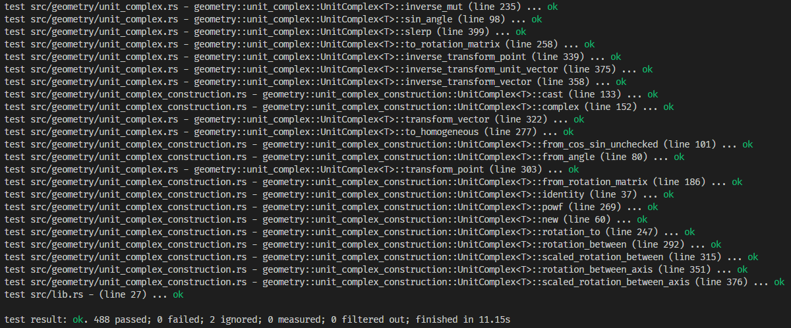

# Community Software Analysis Proposal

## Software: _nalgebra_

_nalgebra_ was created by [Dimforge](https://github.com/dimforge) and is a linear algebra library written in and for Rust. The library offers support for vectors, matrices, decompositions (Cholesky and QR), transformations, SVD, and a lot more. According to their website, _"It targets applications requiring efficient vector and matrix operations, as well as geometric transformations. It is designed to be fast and comprehensive."_ One of the many draws to Rust as a language is its performance (one of... many people would argue the language features, type system, and compiler are just as great), so it is only sensible to have a growing library of linear algebra tools in the Rust ecosystem. _nalgebra_ targets people in the data science and machine learning realm, as well as the graphics world (through nalgebra-glm).

### Stats

| Description                                           | Your answer                                                                                                                                                                                                                                                                             |
| ----------------------------------------------------- | --------------------------------------------------------------------------------------------------------------------------------------------------------------------------------------------------------------------------------------------------------------------------------------- |
| Repository URL                                        | https://github.com/dimforge/nalgebra                                                                                                                                                                                                                                                    |
| Documentation website                                 | https://docs.rs/nalgebra/latest/nalgebra/                                                                                                                                                                                                                                               |
| Main website                                          | https://nalgebra.org/                                                                                                                                                                                                                                                                   |
| Year project was started                              | 2013                                                                                                                                                                                                                                                                                    |
| Number of contributors in the past year               | 37                                                                                                                                                                                                                                                                                      |
| Number of contributors in the lifetime of the project | 214                                                                                                                                                                                                                                                                                     |
| Number of distinct affiliations                       | sponsored by 4 companies (used by 31.4k)                                                                                                                                                                                                                                                |
| Where do development discussions take place?          | GitHub issues/PRs, [StackOverflow](https://stackoverflow.com/questions/tagged/nalgebra), and [Discord](https://discord.gg/vt9DJSW)                                                                                                                                                      |
| Typical number of emails/comments per week?           | Discord server gets dozens of messages per day with frequent answers, looks like 1-3 issues are closed per month.                                                                                                                                                                       |
| Typical number of commits per week?                   | None since January, but usually a lot of commits over 1-2 days for a month at a time. Typically 15-20 commits in each of those time periods.                                                                                                                                            |
| Typical commit size                                   | ~1-2 files changed, ~25 insertions, ~25 deletions (recently ~1 file changed, ~1-5 inserations, ~1-5 deletions)                                                                                                                                                                          |
| How does the project accept contributions?            | According to their website: _"you should start by forking the repository. Once you are done making modifications to your own copy of nalgebra, you have to create a pull request targeting the dev branch so that your contribution can be reviewed, commented, and eventually merged"_ |
| Does the project have an automated test suite?        | yes                                                                                                                                                                                                                                                                                     |
| Does the project use continuous integration?          | yes, GitHub Actions run tests, format, and build docs and wasm/cuda releases                                                                                                                                                                                                            |
| Are any legal/licensing steps required to contribute? | no, and uses Apache-2.0 license                                                                                                                                                                                                                                                         |

### Install and run

Check the following boxes when complete or add a note below if you
encountered a problem.

- [x] I have installed the software
- [x] I have run at least one example
- [x] I have run the test suite
- [x] The test suite passes

### Notes/concerns/risks

Project seems to have stopped receving super active contributions (only some typos fixed in latest commits) but is has a lot of support on Discord.

#### Note on copyright

Students retain copyright on any work done in completion of a CU
course, so you are authorized to sign a [contributor license
agreement (CLA)](https://en.wikipedia.org/wiki/Contributor_License_Agreement),
affirm a [developer's certificate of
origin (DCO)](https://en.wikipedia.org/wiki/Developer_Certificate_of_Origin),
etc. If you have concerns about this, please note them and/or reach
out to Jed directly.
